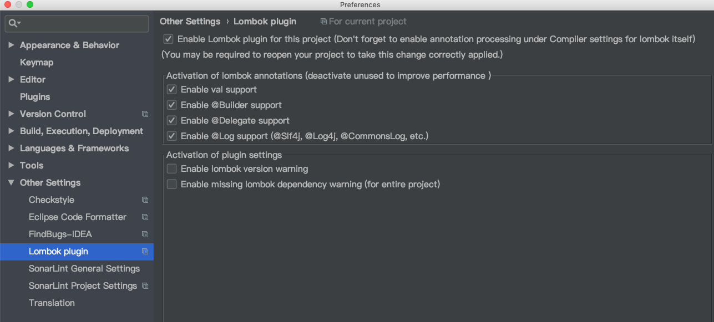
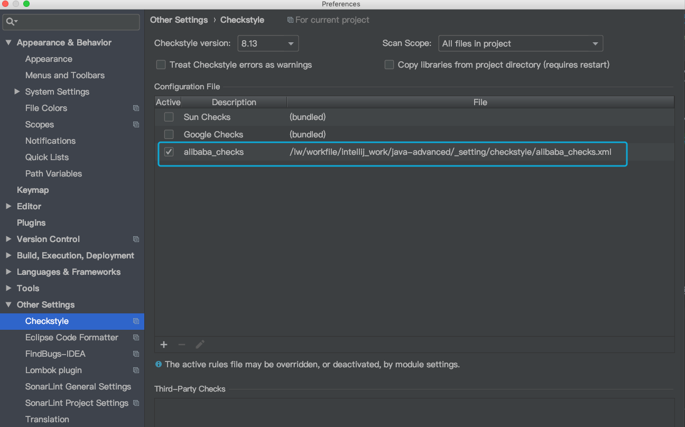
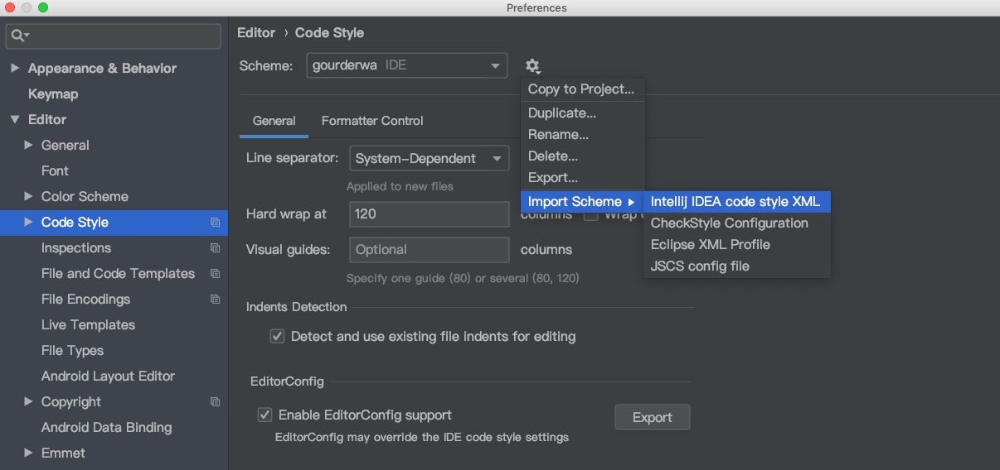
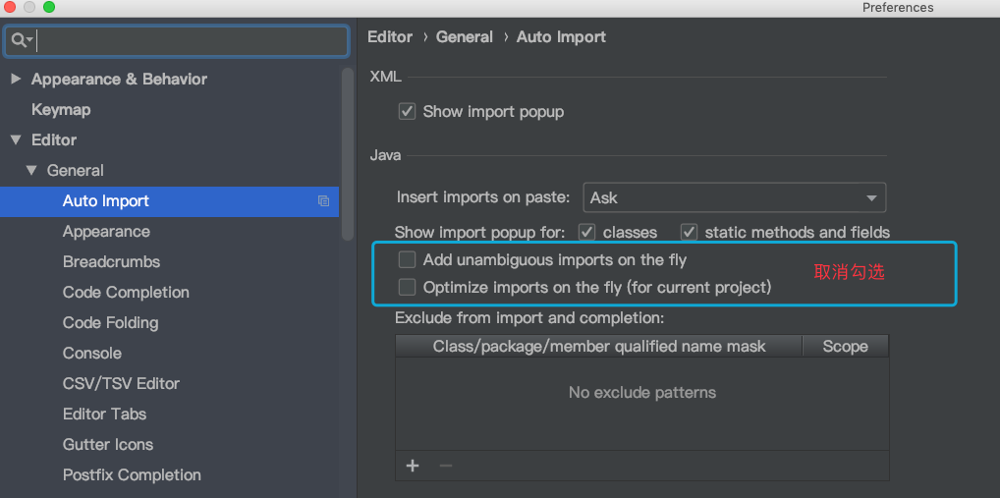
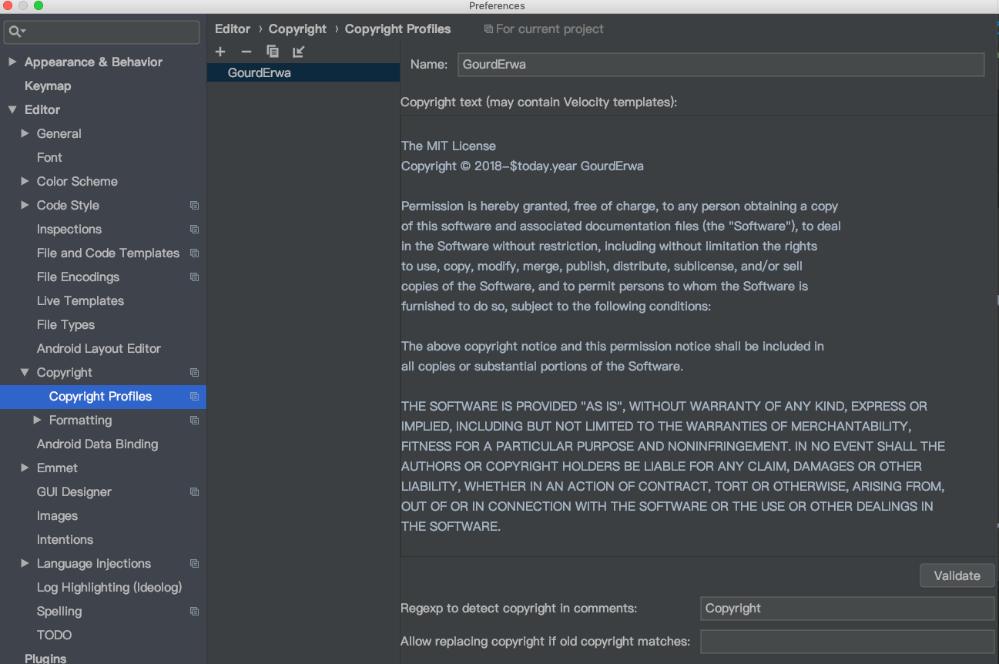
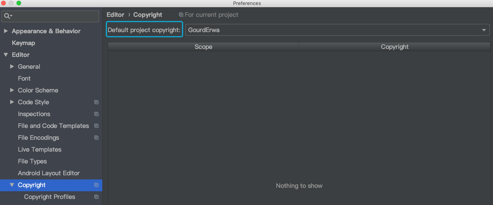

# 编码和命名惯例
## 编码惯例
团队合作中编码管理是非常重要的。它不仅使得代码整齐及整洁，它也节省了许多的工作。不同的代码惯例（自动格式化）将会导致不必要的代码改动使得在代码复审和合并时需要更多的努力。

对于 Java 代码，我们使用 Eclipse 默认的格式化配置，其中一个改动允许长行。

* 对于 Eclipse 开发者，无需手动设置。代码格式化配置 _setting/eclipse.formatter/org.eclipse.jdt.core.prefs 在 git 仓库。当项目被引入时，您的 IDE 应该自动配置。
* 对于 Intellij IDEA 开发者，您需要安装 “Eclipse Code Formatter” 并手动将 Eclipse 格式化配置加载到您的 IDE。详细内容请看搭建开发环境。

我们在 maven 中有 checkstyle plugin 能强制进行规范检查。
对于 JavaScript，XML 和其它编码，请使用空格来缩进。作为常规，请保持代码格式与现有行一致。目前没有其他的强制措施。

## 配置命名惯例（参考 [Kylin](http://kylin.apache.org/cn/development/coding_naming_convention.html)）

配置文件命名惯例
对于配置文件如日志配置，spring 配置，mapreduce job 配置等。

惯例是 words-separated-by-dash.ext，所有的字符要小写。
基本原理：要和 hadoop 配置文件命名一致，即。hdfs-site.xml
>正面例子：kylin-server-log4j.properties
>反面例子：kylin_hive_conf.xml，应该为 kylin-hive-conf.xml

# 搭建开发环境

## 安装 Java（≥1.8）

## 安装 Maven（≥3.0）

  最新的 Maven 下载地址：[Maven-download](http://maven.apache.org/download.cgi)，我们创建一个符号，以便 mvn 可以在任何地方运行。


## 安装 IDE [Lombok](https://www.projectlombok.org/setup/Intellij) 插件




## 安装 IDE Check-Style 插件
目前使用 alibaba_checks.xml ，位于GitHub [alibaba_checks.xml](./_setting/checkstyle/alibaba_checks.xml)
pom 中集成 maven-checkstyle-plugin 插件， ${maven.checkstyle.file} 配置对应目录，默认无需修改




## 安装 IDE Eclipse Code Formatter 格式化插件

对于 Eclipse 用户，目前未支持格式化操作，推荐使用 Intellij IDEA。

对于 Intellij IDEA 用户，您还需要执行一些额外步骤：

* Preference => Code Style => Java import [Code.Style.gourderwa.xml](./_setting/intellij/Code.Style.gourderwa.xml)，




* 禁用 Intellij IDEA 的 “Optimize imports on the fly”



## 设置 IDE License 头部模板

每一个源文件都应该包括以下的 [LICENSE.md](./LICENSE.md) 头部

```
The MIT License
Copyright © 2018-2018 GourdErwa

Permission is hereby granted, free of charge, to any person obtaining a copy
of this software and associated documentation files (the "Software"), to deal
in the Software without restriction, including without limitation the rights
to use, copy, modify, merge, publish, distribute, sublicense, and/or sell
copies of the Software, and to permit persons to whom the Software is
furnished to do so, subject to the following conditions:

The above copyright notice and this permission notice shall be included in
all copies or substantial portions of the Software.

THE SOFTWARE IS PROVIDED "AS IS", WITHOUT WARRANTY OF ANY KIND, EXPRESS OR
IMPLIED, INCLUDING BUT NOT LIMITED TO THE WARRANTIES OF MERCHANTABILITY,
FITNESS FOR A PARTICULAR PURPOSE AND NONINFRINGEMENT. IN NO EVENT SHALL THE
AUTHORS OR COPYRIGHT HOLDERS BE LIABLE FOR ANY CLAIM, DAMAGES OR OTHER
LIABILITY, WHETHER IN AN ACTION OF CONTRACT, TORT OR OTHERWISE, ARISING FROM,
OUT OF OR IN CONNECTION WITH THE SOFTWARE OR THE USE OR OTHER DEALINGS IN
THE SOFTWARE.
```

1. 设置 Copyright.Profiles



2. 激活 Copyright.Profiles


