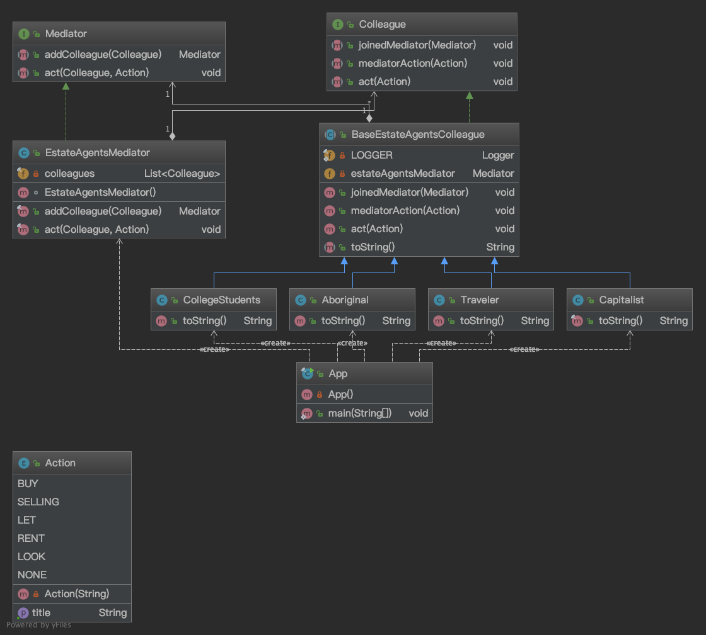

# 设计模式-中介者模式（Mediator pattern）
# 概述
>Mediator设计模式可以解决哪些问题？
>* 避免一组交互对象之间的紧密耦合。
>* 可以独立地改变一组对象之间的交互。
>通过直接访问或者更新来定义一组交互对象是不灵活的，因为交互对象中任何一个对象发生变化，与其交互的其他对象都需要得到通知。
>紧密耦合的对象很难实现，更改，测试和重用，因为它们引用许多不同的对象。

>Mediator设计模式描述了什么解决方案？
>* 定义一个单独的（中介）对象，该对象封装一组对象之间的交互。
>* 对象将其交互委托给中介对象，而不是直接相互交互。
>对象通过控制和协调交互的中介对象间接地相互交互。
>这使得对象松散耦合。他们只与中介对象交互。

# 定义
>Mediator Pattern的本质是“定义一个封装一组对象如何交互的对象”。它通过使对象明确地相互引用来促进松耦合，并且允许它们的交互独立变化。

>客户端类可以使用中介向其他客户端发送消息，并可以通过中介类上的事件从其他客户端接收消息。

# 类图
## WIKI.UML diagram

## WIKI.Class diagram

## 模拟示例.Class diagram

# 适用场景
* 优点
    1. 简化对象之间的关系，将系统的各个对象之间的相互关系进行封装，将各个对象类解耦，使得系统变为松耦合。
    2. 提供系统的灵活性，使得各个对象独立而易于复用。
* 缺点
    1. 中介者角色承担了较多的责任，所以一旦这个中介者对象出现了问题，整个系统将会受到重大的影响。
    2. 新增加一个对象类时，不得不去修改抽象中介者类和具体中介者类，此时可以使用观察者模式和状态模式来解决这个问题。
* 适用
    1. 一组定义良好的对象，现在要进行复杂的相互通信。
    2. 想通过一个中间类来封装多个类中的行为，而又不想生成太多的子类。
# 相关链接
* [wiki.Mediator pattern](https://en.wikipedia.org/wiki/Mediator_pattern)
