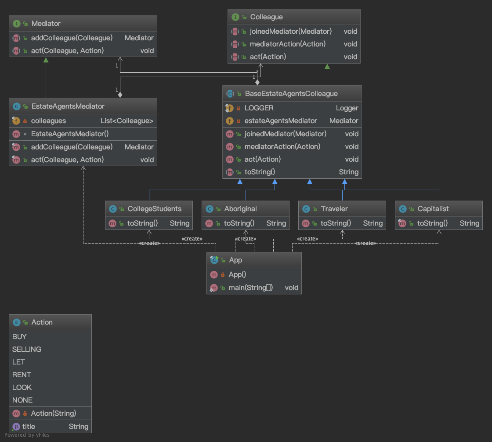

# 23种设计模式-原型模式（Prototype pattern）

# 定义
>原型模式是一种创建型设计模式，Prototype模式允许一个对象再创建另外一个可定制的对象，根本无需知道任何如何创建的细节,
工作原理是:通过将一个原型对象传给那个要发动创建的对象，这个要发动创建的对象通过请求原型对象拷贝它们自己来实施创建。
此模式用于：
* 避免客户端应用程序中的对象创建者的子类，如工厂方法模式。
* 避免以标准方式创建新对象的实时消耗大量资源（例如，使用'```new```'关键字），当它对于给定的应用程序来说过于昂贵时。

# 概述
>可以解决哪些问题？
>* 如何在运行时创建要创建的对象？由于需求的变化，这些对象经常面临着剧烈的变化，如何拥有比较稳定一致的接口？
>* 如何实例化动态加载的类？
>直接在需要（使用）对象的类中创建对象是不灵活的，因为它在编译时将类提交到特定对象，并且无法指定在运行时创建哪些对象。

>如何解决上述问题？
>* 定义一个Prototype返回自身副本的对象。
>* 通过复制Prototype对象创建新对象，实现  java ```Cloneable#clone()```方法。
>这样就可以配置具有不同Prototype对象的类，这些对象被复制以创建新对象，甚至Prototype可以在运行时添加和删除对象。


# 类图
## WIKI.UML diagram

## WIKI.Class diagram

## 项目模拟示例.Class diagram


# 用途
* 优点
    1. 减少对象创建过程中性能开销
    2. 使用对象的副本创建新对象时统一对象的生成接口，需求变动后仅修改 clone 方法即可。
* 缺点
    1. 涉及到对象**浅拷贝&深拷贝**问题，需要谨慎对待
    2. ```final``` 类型修饰的成员变量不能进行深拷贝
* 适用场景
    1. 类初始化需要消化非常多的资源，这个资源包括数据、硬件资源等
    2. 通过 new 产生一个对象需要非常繁琐的数据准备或访问权限
    3. 一个对象需要提供给其他对象访问，而且各个调用者可能都需要修改其值时，可以考虑使用原型模式拷贝多个对象供调用者使用
>在实际项目中，原型模式很少单独出现，一般是和工厂方法模式一起出现，通过```Cloneable#clone()```的方法创建一个对象，然后由工厂方法提供给调用者。
原型模式先产生出一个包含大量共有信息的类，然后可以拷贝出副本，修正细节信息，建立了一个完整的个性对象。

# 衍生思考
* ```Cloneable#clone()```方法如何减少性能开销
* 浅拷贝&深拷贝问题
* 为什么 ```final``` 类型修饰的成员变量不能进行深拷贝
* java jdk 中3个没有定义方法的接口分别是？作用是？

# 相关链接
* [源码](https://github.com/GourdErwa/java-advanced/tree/master/design-patterns/patterns-prototype)
* [wiki.Mediator pattern](https://en.wikipedia.org/wiki/prototype_pattern)
